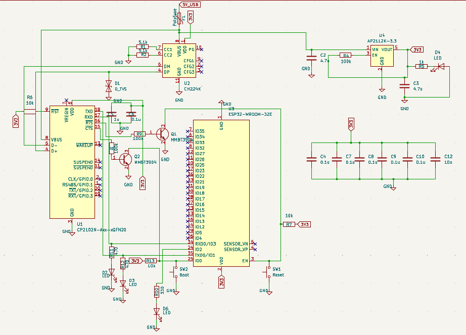
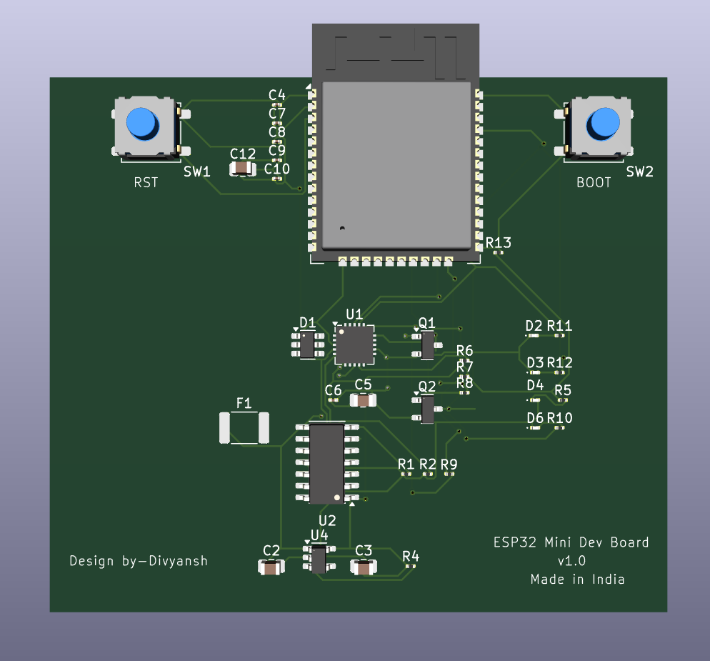
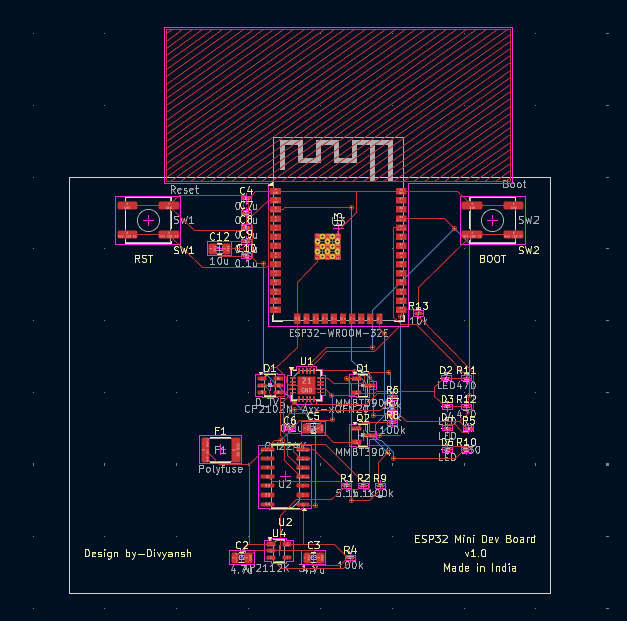

<div align="center">

# 📡 ESP32 Mini Dev Board

### Custom Hardware Design | USB-C | KiCad | 2-Layer PCB


*A high-performance embedded development board with complete hardware design workflow, from schematic to manufacturable PCB*

[Introduction](#-introduction) • [Features](#-key-features) • [Design](#-circuit-breakdown) • [Manufacturing](#-manufacturing-guide) • [Resources](#-design-tools)

</div>

---

## 📖 Introduction

The **ESP32 Mini Dev Board** is a custom-designed embedded hardware platform that demonstrates professional PCB design practices, USB-C integration, power integrity, RF-aware layout, and manufacturable routing techniques.

### 🎯 Project Objectives

This project was built to showcase:
- **End-to-end hardware design** — From concept to fabrication-ready Gerbers
- **ESP32 reference compliance** — Following Espressif hardware design guidelines
- **USB-C power delivery** — Modern interface with proper CC resistor configuration
- **Auto-programming circuitry** — Reliable EN/IO0 control for seamless firmware upload
- **Professional PCB layout** — RF keep-out zones, impedance control, and signal integrity

### 💡 Why This Project Matters

Most commercial ESP32 boards are closed-source, hiding critical design decisions. This project was created to:
- **Learn real hardware engineering** beyond just writing firmware
- **Build a portfolio-grade reference design** for embedded systems roles
- **Demonstrate practical PCB skills** relevant to industry applications
- **Create an educational resource** for aspiring hardware engineers

---

## 🚀 Key Features

### ⚡ Power Electronics & Protection
- **USB-C powered** with CH224K power negotiation IC (5V sink)
- **AP2112K-3.3 LDO** voltage regulator with input/output filtering
- **Resettable polyfuse** (500mA) for over-current protection
- **TVS diode array** (SOT-23-6) for USB ESD protection
- **Proper decoupling network** with bulk and bypass capacitors

### 🧠 Microcontroller & Wireless
- **ESP32-WROOM-32E** module with integrated PCB antenna
- **Dual-core Xtensa LX6** @ 240 MHz
- **Wi-Fi 802.11 b/g/n** with TCP/IP stack
- **Bluetooth Classic & BLE 4.2**
- **4 MB flash memory** for firmware and data storage
- **34 GPIO pins** with ADC, DAC, SPI, I2C, UART support

### 🔄 Programming & Debug Interface
- **CP2102N USB-UART bridge** (no external FTDI adapter required)
- **Auto-reset circuitry** using dual NPN transistors (Q1/Q2)
- **One-click firmware upload** compatible with Arduino IDE, ESP-IDF, PlatformIO
- **DTR/RTS control** for automatic bootloader entry

### 🎛️ User Interface & Indicators
- **Reset button** — Hardware reset via EN pin
- **Boot/Flash button** — Manual bootloader entry (IO0 → GND)
- **Power LED** — Visual confirmation of 3.3V rail
- **Compact form factor** — Optimized for breadboard prototyping

### 🧱 PCB Engineering Highlights
- **2-layer PCB design** with solid ground planes
- **RF-aware layout** — 15mm antenna keep-out zone respected
- **USB differential pairs** — Controlled impedance routing for D+/D–
- **Ground stitching vias** — Low-impedance return paths
- **DRC-clean design** — Fabrication-ready with zero errors
- **Designed in KiCad 8.x** — Open-source EDA workflow

---

## 🆚 Comparison with Generic ESP32 Boards

| Engineering Aspect | Generic Boards | ESP32 Mini Dev Board |
|:---|:---:|:---:|
| **USB Interface** | Micro-USB | USB-C |
| **Power Design** | Basic AMS1117 | AP2112 + filtering |
| **Auto-Programming** | Inconsistent | Robust EN/IO0 circuit |
| **ESD Protection** | Rarely included | TVS diode implemented |
| **PCB Quality** | Average layout | RF-aware professional design |
| **Learning Value** | Low (closed-source) | High (educational project) |
| **Design Files** | Not available | Fully open-source |

---

## 📁 Repository Structure

```
ESP32-Mini-Dev-Board/
├── hardware/
│   ├── esp32-mini.kicad_pro       # KiCad project file
│   ├── esp32-mini.kicad_sch       # Schematic design
│   ├── esp32-mini.kicad_pcb       # PCB layout
│   ├── gerbers/                   # Manufacturing files (Gerber + drill)
│   ├── bom.csv                    # Bill of materials
│   ├── renders/                   # 3D visualization exports
│   │   ├── schematic.pdf
│   │   ├── pcb-top.png
│   │   └── 3d-model.png
│   └── datasheets/                # Component reference documents
├── docs/
│   ├── design-notes.md            # Design decisions & rationale
│   ├── esp32-hardware-guide.pdf   # Espressif reference manual
│   ├── usb-c-integration.md       # USB-C implementation guide
│   └── power-analysis.md          # Power tree & current budget
├── firmware/
│   └── blink-test/                # Basic firmware for board validation
├── images/                        # Project screenshots
├── README.md                      # This file
└── LICENSE                        # MIT License
```

---

## 🧩 System Architecture

```
┌─────────┐    ┌──────────┐    ┌─────────┐    ┌──────┐    ┌────────────┐
│ USB-C   │───▶│ Polyfuse │───▶│   TVS   │───▶│CH224K│───▶│ AP2112-3.3 │───▶ 3.3V Rail
│ VBUS    │    │  500mA   │    │ ESD Prot│    │ 5V   │    │  600mA LDO │
└─────────┘    └──────────┘    └─────────┘    └──────┘    └────────────┘
     │                                                              │
     │         ┌────────────────────────────────────────────────────┘
     │         │
     └──────▶ CP2102N ───▶ Auto-reset Circuit ───▶ ESP32-WROOM-32E
              USB-UART        (Q1/Q2 NPN)           (TX/RX/EN/IO0)
              QFN-20          DTR/RTS Control       MCU + Wi-Fi + BT
```

---

## 🛠️ Design Tools

| Tool | Purpose | Version |
|:-----|:--------|:--------|
| **KiCad EDA** | Schematic capture & PCB layout | 8.0+ |
| **Espressif Guidelines** | ESP32 hardware design reference | v3.9 |
| **Silicon Labs Design** | CP2102N reference circuit | AN758 |
| **WCH App Notes** | CH224K USB-C sink configuration | - |
| **JLCPCB / OSH Park** | PCB manufacturing services | - |

---

## 🧱 Circuit Breakdown

### 1️⃣ Power Stage

**USB-C Input Protection:**
- Polyfuse (500mA) for over-current shutdown
- CH224K negotiates 5V from USB-C port via CC pins
- TVS diode clamps voltage spikes on VBUS line

**3.3V Regulation:**
- AP2112K-3.3 LDO (600mA max output)
- Input: 4.7µF ceramic capacitor (X7R)
- Output: 4.7µF ceramic capacitor (X7R)
- Power LED with 1kΩ current-limiting resistor

### 2️⃣ USB-UART Bridge

**CP2102N (QFN-20 Package):**
- 5.1kΩ CC resistors on USB-C for default 5V power
- D+/D– differential pair routing with 90Ω impedance
- 12 MHz crystal oscillator for USB clock
- TVS diode protection on data lines

**Signal Connections:**
- RXD → ESP32 TX (GPIO1)
- TXD → ESP32 RX (GPIO3)
- DTR → Auto-reset transistor base (Q1)
- RTS → Auto-reset transistor base (Q2)

### 3️⃣ ESP32 Core Module

**ESP32-WROOM-32E Integration:**
- Decoupling capacitors (100nF + 10µF) directly under module pads
- 10kΩ pull-up resistor on EN (enable) pin
- EN pin connected to reset button (momentary, normally open)
- IO0 connected to boot button (momentary to GND)

**GPIO Breakout:**
- All usable GPIOs routed to castellated edges or pin headers
- Strapping pins (GPIO0, GPIO2, GPIO12, GPIO15) clearly labeled

### 4️⃣ Auto-Reset Circuit

**Dual NPN Transistor Configuration:**
- Q1 (2N3904): DTR-controlled EN pull-down
- Q2 (2N3904): RTS-controlled IO0 pull-down
- Resistor network (R6–R10): Base current limiting + biasing
- Replicates ESP32 DevKitC auto-programming behavior

**Operation:**
- DTR/RTS control from CP2102N triggers bootloader mode
- Eliminates need for manual button pressing during upload
- Compatible with esptool.py and Arduino IDE

---

## 📐 PCB Layout Guidelines

### ✅ RF Best Practices
- **15mm antenna keep-out zone** — No copper pour under or near antenna
- **Ground plane cutout** — Prevents impedance mismatch
- **Module orientation** — Antenna facing board edge

### ✅ Signal Integrity
- **USB differential pairs** — Matched length within 5 mils
- **Short trace runs** — Minimize parasitic inductance
- **Ground stitching** — Via fencing around sensitive signals

### ✅ Power Integrity
- **Solid ground plane** on bottom layer (Layer 2)
- **Star grounding** — Single-point connection at LDO output
- **Decoupling placement** — Capacitors within 3mm of IC pins
- **Thermal relief** — Proper pad design for hand soldering

### ✅ Manufacturing Considerations
- **Minimum trace width:** 6 mil (0.15mm)
- **Minimum clearance:** 6 mil (0.15mm)
- **Via size:** 0.3mm drill, 0.6mm pad
- **Silkscreen:** Component references on top layer

---

## 📦 Manufacturing Guide

### Step 1: Generate Production Files

1. Open `esp32-mini.kicad_pro` in KiCad
2. Run **DRC (Design Rule Check)** to verify zero errors
3. Navigate to **File → Plot**
4. Configure Gerber output:
   - Include layers: F.Cu, B.Cu, F.Mask, B.Mask, F.Silkscreen, B.Silkscreen, Edge.Cuts
   - Use Protel filename extensions
5. Generate **drill files** (PTH and NPTH)
6. Create **assembly files** (BOM + Pick-and-Place CSV)

### Step 2: Select PCB Manufacturer

**Recommended Options:**

| Manufacturer | Lead Time | Cost (10 pcs) | Best For |
|:-------------|:----------|:--------------|:---------|
| **JLCPCB** | 2-5 days | $2-5 USD | Budget prototyping |
| **OSH Park** | 10-12 days | $10-15 USD | Premium quality |
| **PCBWay** | 3-7 days | $5-10 USD | Flexible options |

**Recommended Specifications:**
- **Layers:** 2
- **Dimensions:** 67mm × 58mm
- **Thickness:** 1.6mm
- **Copper weight:** 1 oz (35µm)
- **Surface finish:** HASL (lead-free) or ENIG
- **Solder mask:** Green, black, or blue
- **Silkscreen:** White

### Step 3: Order Components

**Key ICs:**
- ESP32-WROOM-32E (Espressif)
- CP2102N-A02-GQFN20 (Silicon Labs)
- AP2112K-3.3TRG1 (Diodes Inc.)
- CH224K (WCH)

**Passive Components:**
- 0805 resistors and capacitors (recommended for hand assembly)
- LEDs: 0805 or 1206 package

**Connectors:**
- USB-C 16-pin mid-mount receptacle
- Tactile switches (6mm × 6mm)

### Step 4: Assembly Options

**Option A: Hand Soldering**
- Use solder paste + hotplate for QFN packages
- Hand-solder through-hole components last
- Inspect under microscope for QFN pad shorts

**Option B: Professional Assembly**
- JLCPCB SMT assembly service (~$15-30 USD)
- Upload BOM and Pick-and-Place files
- Review component placement before confirmation

---

## 🔌 Programming & Usage

### Initial Setup

1. **Connect the board** via USB-C cable to your computer
2. **Driver installation** (usually automatic):
   - Windows: CP210x Universal Driver
   - macOS/Linux: Built-in CDC-ACM driver
3. **Verify COM port** detection:
   - Windows: Device Manager → Ports (COM & LPT)
   - macOS: `ls /dev/cu.usbserial-*`
   - Linux: `ls /dev/ttyUSB*`

### Firmware Upload

#### Using Arduino IDE

```cpp
// 1. Install ESP32 board support:
// File → Preferences → Additional Board Manager URLs
// https://raw.githubusercontent.com/espressif/arduino-esp32/gh-pages/package_esp32_index.json

// 2. Configure board settings:
// Tools → Board → ESP32 Arduino → ESP32 Dev Module
// Tools → Port → COMx (your detected port)
// Tools → Upload Speed → 921600

// 3. Upload firmware:
// Click "Upload" button (auto-reset will handle boot mode)
```

#### Using ESP-IDF

```bash
# Clone ESP-IDF framework
git clone --recursive https://github.com/espressif/esp-idf.git
cd esp-idf
./install.sh

# Set up environment
. ./export.sh

# Build and flash firmware
idf.py build
idf.py -p /dev/ttyUSB0 flash monitor
```

#### Using PlatformIO

```ini
; platformio.ini
[env:esp32dev]
platform = espressif32
board = esp32dev
framework = arduino
monitor_speed = 115200
upload_speed = 921600
```

```bash
pio run --target upload
pio device monitor
```

### Manual Flash Mode (If Auto-Reset Fails)

1. Hold down **BOOT** button
2. Press and release **RESET** button
3. Release **BOOT** button
4. Board is now in download mode (LED may flash)
5. Upload firmware via esptool or IDE

---

## 📸 Project Gallery

<div align="center">

### Complete Schematic Design

*Complete circuit schematic showing power stage, USB-UART bridge, ESP32 core, and auto-reset circuitry*

---

### 3D Render - Component View

*Professional 3D visualization showing component placement, silkscreen, and board layout*

---

### PCB Layout - X-Ray View

*Complete PCB layout with RF keep-out zone (hatched area), ground plane, and optimized routing*

---

### Board Dimensions
**67mm × 58mm** — Compact form factor optimized for prototyping

---

### Key Design Features Visible in Images:
✅ ESP32-WROOM-32E module with antenna clearance  
✅ Symmetrical Reset (SW1) and Boot (SW2) button placement  
✅ USB-C connector with proper CC resistor network  
✅ Auto-reset circuit (U1, Q1, Q2) for seamless programming  
✅ CP2102N USB-UART bridge (U2) with polyfuse protection (F1)  
✅ AP2112K-3.3 LDO regulator (U4) with filtering capacitors  
✅ Status LEDs (D2-D6) for power and activity indication  
✅ Professional silkscreen with "Design by-Divyansh" and "Made in India"  

---

### Assembled Board
*Photo coming soon after fabrication and assembly*

</div>

---

## 🧪 Target Use Cases

This board is designed for:

- 🎓 **Learning embedded hardware design** — Educational reference project
- 💼 **Portfolio demonstration** — Showcasing PCB design skills for jobs
- 🔬 **IoT prototyping** — Wi-Fi/BLE sensor nodes and edge devices
- 🚀 **Firmware development** — Rapid ESP32 software iteration
- 🏭 **Hardware validation** — Testing ESP32 integration in products

---

## 🔮 Future Enhancements

- [ ] **Battery charging circuit** — TP4056 or MCP73831 for LiPo support
- [ ] **Onboard RGB LED** — WS2812B addressable LED for visual feedback
- [ ] **Qwiic/STEMMA connector** — Standardized I²C interface for sensors
- [ ] **4-layer PCB** — Dedicated power/ground planes for better RF performance
- [ ] **LiPo fuel gauge** — MAX17048 for battery monitoring
- [ ] **USB-C PD trigger** — Negotiate 9V/12V for higher power applications
- [ ] **SD card slot** — SPI-based microSD for data logging

---

## 🏆 License

**MIT License**

This project is open-source hardware, free to use, modify, and distribute for personal, educational, or commercial purposes.

See [LICENSE](LICENSE) file for full legal text.

---

## ❤️ Acknowledgments

Special thanks to:

- **Espressif Systems** — Comprehensive ESP32 documentation and hardware design guidelines
- **Silicon Labs** — CP2102N reference designs and USB-UART best practices
- **WCH (Nanjing Qinheng Microelectronics)** — CH224K USB-C sink IC application notes
- **KiCad Development Team** — Industry-leading open-source EDA software
- **Open-source hardware community** — Inspiration from countless reference designs

---

## 📬 Contact & Contributions

### 👨‍💻 Author

**Divyansh Tiwari**  
Embedded Systems Engineer | PCB Designer | IoT Hardware Developer

- 📧 Email: [divyanshtiwari435@gmail.com](mailto:divyanshtiwari435@gmail.com)
- 🐙 GitHub: [@divyansh404-sudo](https://github.com/divyansh404-sudo)
- 🌐 Portfolio: *[Add your portfolio link]*
- 💼 LinkedIn: *[Add your LinkedIn]*

### 🤝 Contributing

Found a bug? Have an improvement suggestion? Contributions are welcome!

1. Fork this repository
2. Create a feature branch (`git checkout -b feature/amazing-improvement`)
3. Commit your changes (`git commit -m 'Add some amazing improvement'`)
4. Push to the branch (`git push origin feature/amazing-improvement`)
5. Open a Pull Request

---

## 🧠 Why Recruiters Value This Project

✅ **Demonstrates real hardware engineering** — Not just software on existing boards  
✅ **Shows end-to-end PCB design workflow** — From schematic to manufacturing  
✅ **Uses industry-standard tools** — KiCad, Gerber files, professional documentation  
✅ **Highlights practical embedded skills** — USB interfaces, power design, RF layout  
✅ **Portfolio-grade documentation** — Clear, professional presentation  
✅ **Open-source contribution** — Demonstrates willingness to share knowledge  

---

<div align="center">

**⭐ Star this repository if you found it useful! ⭐**

---

**Made with ❤️ and lots of ☕ in India 🇮🇳**


</div>
